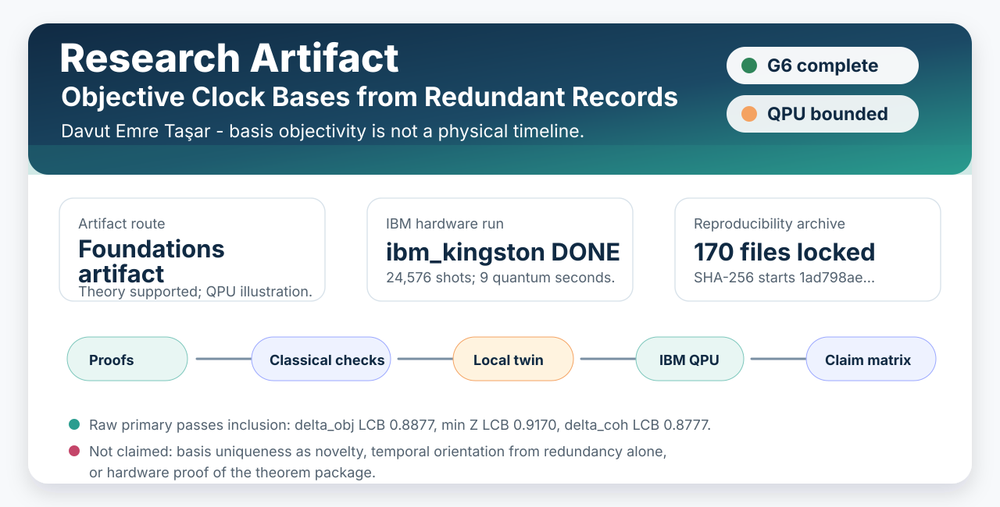
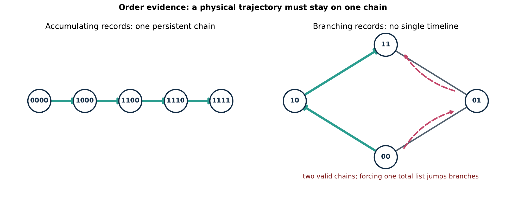
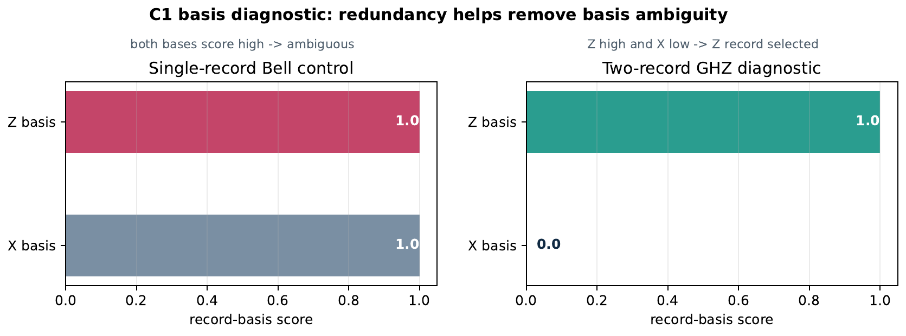
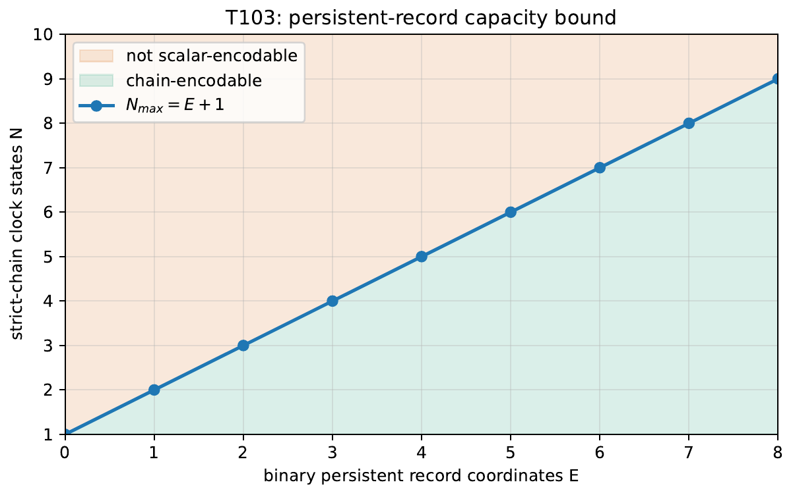
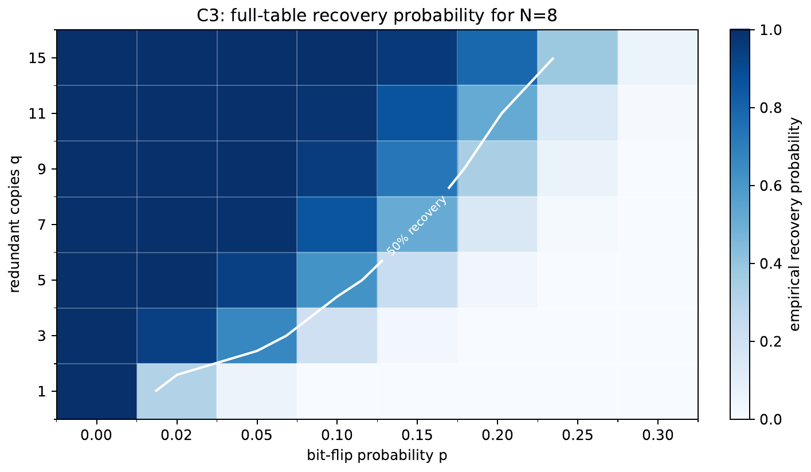
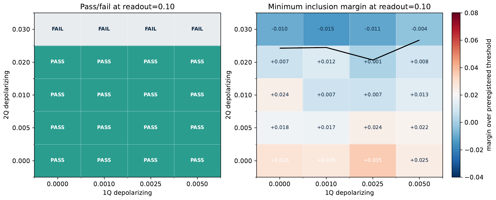
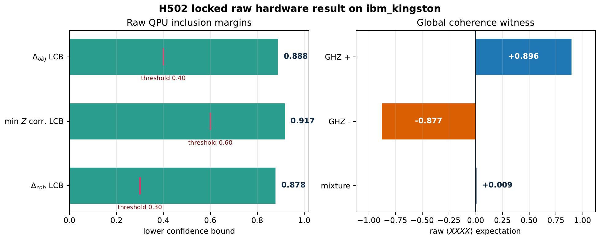

# Research Artifact and Reproducibility Package: Objective Clock Bases from Redundant Records



**Author:** Davut Emre Taşar

This repository is a self-contained research artifact and reproducibility
package. It is formatted as a public-facing artifact, not as an internal
execution log or manuscript submission.

This is a **quantum systems experiment repository**. The word `clock` does not
mean a wall clock or a timing device. It means a candidate quantum subsystem
whose basis states are being interpreted as possible time labels inside a
larger quantum state. The central issue is whether redundant records in other
subsystems can make those labels objective, ordered, and oriented.

If you are not a quantum physicist, read the project as a carefully bounded
experiment about **when quantum records are enough to reconstruct a timeline**.
The short answer is: records can identify labels, but labels alone do not give
you a physical timeline.

The main narrative report is available as
[PDF](reports/research_artifact_and_reproducibility_package.pdf) and
[LaTeX source](reports/research_artifact_and_reproducibility_package.tex). It
is the best entry point for readers who want the motivation, concept map,
figures, evidence tables, literature positioning, and reproducibility story in
one place.

## Scientific Motivation

The work starts from a tension in quantum foundations. Quantum Darwinism and
environment-as-a-witness arguments explain how many environment fragments can
carry redundant information about selected system properties. Related
objective-past work asks how redundant records can support agreement about
histories. Fu's fixed-partition redundant-imprint uniqueness result also
clarifies when an observable can be selected by redundant imprints, while
leaving partition dependence as a real boundary.

Those results motivate a sharper clock question. If a quantum state contains a
candidate `clock` subsystem and two independent record fragments agree on its
labels, have we recovered time? This repository tests the answer:

> When redundant records make a clock basis objective, what extra structure is
> still required to recover event order and temporal orientation?

The completed package supports a narrow answer: redundant records can make a
basis objective under fixed-partition assumptions already known in the
literature, but basis objectivity is not yet a physical timeline. The recorded
labels must also form persistent chains, and some physical anchor must choose
which direction is earlier-to-later. Branching linear extensions are scheduler
totalizations, not physical histories.

## Experimental System

The bounded hardware illustration uses a four-qubit quantum system:

| Logical qubit | Role |
| --- | --- |
| `C` | candidate clock-label subsystem |
| `S` | companion system qubit used in the GHZ coherence witness |
| `R1`, `R2` | independently accessible record fragments |

The GHZ state tests whether `R1` and `R2` redundantly record the `C` label in
the `Z` basis. A matched dephased-control state preserves the same local `Z`
records but removes global `X` coherence. That separation is important: local
record objectivity and global coherence are not the same claim. The IBM QPU run
is therefore used only as a bounded four-qubit illustration of the measurement
workflow, not as the proof of the theorem package.

## Plain-Language Reading

Think of the candidate quantum clock label as a page number in a book, and the
record fragments as independent notes copied from that page. If two notes agree
on the page number, that helps make the label objective. But it still does not
tell you whether the pages form one readable story, whether two story branches
split apart, or which direction the story should be read. This repository tests
exactly those missing pieces.

In the figures:

- `0` and `1` are record bits, not ordinary decimal numbers.
- A high basis score means a record fragment carries that label well.
- A chain means the record bits can accumulate without losing earlier records.
- Coherence is a separate quantum property; it is not the same thing as having
  readable local records.

Everyday analogy to quantum object:

| Everyday idea | Quantum object in this repo | Why it matters |
| --- | --- | --- |
| Page number | `C`, the candidate clock-label subsystem | This is the label we are tempted to call "time." |
| Independent notes about the page | `R1` and `R2`, the record fragments | If both notes agree, the label is more objective. |
| A readable story | A chain in the record-dominance poset | A timeline must keep previous records instead of jumping between branches. |
| Reading direction | Orientation anchor | Records alone can say "these pages are connected" without saying which way is earlier. |
| Ink pattern visible on many copies | Redundant record basis | The same label is recoverable from more than one accessible fragment. |
| Hidden binding across pages | Global quantum coherence | This is a separate quantum witness, not the same as local record readability. |

## Core Distinction

The artifact separates three layers that are easy to conflate:

| Layer | Question | What the artifact checks |
| --- | --- | --- |
| Basis | Which quantum alternatives are redundantly recorded? | Fixed-partition record objectivity and GHZ/dephased controls. |
| Order | Can the recorded snapshots persistently follow one another? | Record-dominance posets, chains, capacity bounds, and branching counterexamples. |
| Orientation | Which direction is earlier-to-later? | Orientation-swap no-go examples and the requirement for an anchor beyond redundancy. |

## Concept Map

| Concept | Meaning in this artifact |
| --- | --- |
| Clock basis | A basis of a quantum subsystem whose labels are candidate time labels; it is not a literal clock face. |
| Objective basis | A record basis recoverable from redundant fragments under a fixed admissible quantum partition. |
| Record signature | The tuple of fragment record values attached to a candidate snapshot, such as `00`, `10`, or `11`. |
| Record-dominance poset | The partial order induced by persistent records: later snapshots may add records but should not lose existing ones. |
| Chain | A totally ordered subset of the poset; this is the candidate persistent trajectory. |
| Linear extension | A scheduler-style totalization of a poset. In a branching poset, it is not automatically a physical history. |
| Scalar time | Available only when all relevant nonduplicate snapshots form one chain. |
| Orientation anchor | Extra structure that chooses earlier-to-later direction; redundancy alone does not provide it. |

| Field | Value |
| --- | --- |
| Artifact title | Research Artifact and Reproducibility Package: Objective Clock Bases from Redundant Records |
| Author | Davut Emre Taşar |
| Scientific freeze | `v0.9.0-g6-final-interpretation` |
| Artifact route | foundations artifact with bounded quantum illustration |
| Hardware status | one bounded IBM QPU illustration completed on `ibm_kingston` |
| Archive | `objective-clocks-reproducibility.tar.gz`; current SHA-256 is recorded in [A603 manifest](results/processed/A603_reproducibility_manifest.json) and [final decision](docs/FINAL_DECISION.md) |
| Full report | [PDF](reports/research_artifact_and_reproducibility_package.pdf), [LaTeX](reports/research_artifact_and_reproducibility_package.tex) |

This README is a navigation and presentation layer for the frozen scientific
package. The reproducibility archive records the exact G6 package and source
commit used for the final decision.

The public source tree, processed outputs, raw provider payloads, reports, and
archive manifest are intended to be sufficient for scientific inspection without
local credentials.

## Result At A Glance

| Question | Answer | Primary evidence |
| --- | --- | --- |
| Which basis is objectively recorded? | Fixed-partition redundant records identify a record basis, but this is not claimed as the new contribution. | [B0 proof note](docs/proofs/B0_imported_basis_uniqueness.md), [C1 landscape](results/processed/C1_basis_landscape_summary.json) |
| Do records define a scalar time? | Only when the relevant snapshots form a single chain. | [O1 chain proof](docs/proofs/O1_chain_characterization.md), [T101 checks](results/processed/T101_chain_verification.json) |
| What is the main contribution? | The basis-order-orientation separation, record-capacity results, and partition/orientation no-go package. | [research notes](docs/RESEARCH_SPEC_TR.md), [proofs](docs/proofs), [counterexamples](results/processed/counterexample_catalog.json) |
| Did the QPU run finish? | Yes. `ibm_kingston`, job `d8rfasuab0ds73drkaig`, status `DONE`, 24 circuit instances, 24,576 shots, 9 quantum seconds. | [provider payload](results/raw/H501_provider_payload_d8rfasuab0ds73drkaig.json), [hardware notes](docs/G5_HARDWARE_NOTES.md) |
| What did the QPU result support? | It passed the locked raw inclusion rule and is included only as a four-qubit illustration. | [raw analysis](results/processed/Q3_hardware_raw.json), [final decision](docs/FINAL_DECISION.md) |
| Are unsupported claims left? | No. A601 records 10 claims, 0 unsupported, 2 Q-grade hardware illustration claims. | [claim matrix](results/claim_evidence_matrix.csv), [claims register](docs/CLAIMS_REGISTER.md) |

## What Is In The Repository

| Area | Contents |
| --- | --- |
| Theory and proofs | [docs/RESEARCH_SPEC_TR.md](docs/RESEARCH_SPEC_TR.md), [docs/proofs](docs/proofs) |
| Implementation | [src/objective_clocks](src/objective_clocks), [scripts](scripts), [configs](configs), [tests](tests) |
| Raw hardware records | [results/raw/H501_provider_payload_d8rfasuab0ds73drkaig.json](results/raw/H501_provider_payload_d8rfasuab0ds73drkaig.json), submission receipts, and the cancelled pre-result Marrakesh receipt |
| Processed results | [results/processed](results/processed), including G0-G6 manifests, theorem outputs, classical experiments, quantum local checks, raw QPU analysis, mitigated secondary analysis, and final decision data |
| Figures | Publication PDFs in [figures](figures) and README preview images in [assets/readme](assets/readme) |
| Research report | [reports/research_artifact_and_reproducibility_package.pdf](reports/research_artifact_and_reproducibility_package.pdf), [source](reports/research_artifact_and_reproducibility_package.tex) |
| Experiment journal | [reports/experiment_report.tex](reports/experiment_report.tex) |
| Reproducibility archive | [objective-clocks-reproducibility.tar.gz](objective-clocks-reproducibility.tar.gz) plus [A603 manifest](results/processed/A603_reproducibility_manifest.json) |

Not included: IBM tokens, local `.env` files, virtual environments, cache
directories, or complete terminal session transcripts. The scientific evidence
that matters for reproduction is tracked through raw payloads, processed
artifacts, manifests, reports, SHA-256 records, and the final archive.

## How To Read The Experiment Codes

The repository uses short task codes so every result can be traced to the script
that produced it. They are not physics notation.

| Code family | Meaning | Example |
| --- | --- | --- |
| `T` | theorem/property checks used to catch logical mistakes | `T101` verifies the chain criterion |
| `C` | classical or exact computational experiments | `C1` tests basis ambiguity; `C5` checks exact GHZ values |
| `Q` | local quantum-readiness steps before real hardware | `Q302` stress-tests the protocol in simulation |
| `H` | IBM hardware execution and analysis | `H501` is the submitted QPU job; `H502` is raw analysis |
| `A` | audit, interpretation, and reproducibility packaging | `A601` is the claim matrix; `A603` is the archive manifest |
| `G` | gates that group the workflow into phases | `G2` means classical experiments are complete |

## What The Experiment Is Not

- It is not a project about building a physical clock.
- It is not claiming that IBM hardware proves the theorem package.
- It is not claiming fixed-partition basis uniqueness as a new discovery.
- It is not using mitigation to rescue a failed raw QPU result.
- It is not treating every total ordering of records as a physical history.

## Start Here

| Need | File |
| --- | --- |
| Full narrative report | [reports/research_artifact_and_reproducibility_package.pdf](reports/research_artifact_and_reproducibility_package.pdf) |
| Fast scientific conclusion | [docs/FINAL_DECISION.md](docs/FINAL_DECISION.md) |
| Detailed research notes | [docs/RESEARCH_SPEC_TR.md](docs/RESEARCH_SPEC_TR.md) |
| Architecture and dependency diagrams | [docs/ARCHITECTURE.md](docs/ARCHITECTURE.md) |
| Frozen preregistration | [docs/PREREGISTRATION_FROZEN.md](docs/PREREGISTRATION_FROZEN.md) |
| Hardware execution notes | [docs/G5_HARDWARE_NOTES.md](docs/G5_HARDWARE_NOTES.md) |
| Claim grades | [docs/CLAIMS_REGISTER.md](docs/CLAIMS_REGISTER.md) and [results/claim_evidence_matrix.csv](results/claim_evidence_matrix.csv) |
| Citation metadata | [CITATION.cff](CITATION.cff) |
| Changelog | [CHANGELOG.md](CHANGELOG.md) |

## Data Flow

```mermaid
flowchart LR
  Spec["Theory specification"] --> G1["G1 proofs and exact primitives"]
  G1 --> G2["G2 classical C0-C5 experiments"]
  G2 --> G3["G3 local quantum readiness"]
  G3 --> G4["G4 frozen preregistration"]
  G4 --> H501["H501 one gated IBM run"]
  H501 --> H502["H502 raw primary analysis"]
  H502 --> H503["H503 secondary readout correction"]
  H502 --> A601["A601 claim evidence matrix"]
  H503 --> A601
  A601 --> A602["A602 final decision"]
  A602 --> A603["A603 reproducibility archive"]
```



The hardware path is deliberately downstream of the theory and classical checks.
The theorem-level and no-go claims survive without the IBM observation.

## Reproduce

### 1. Inspect the frozen result

```bash
git clone <repo-url>
cd quantum-time-experiment
git checkout v0.9.0-g6-final-interpretation
python - <<'PY'
import hashlib, json
manifest = json.load(open("results/processed/A603_reproducibility_manifest.json"))
actual = hashlib.sha256(open("objective-clocks-reproducibility.tar.gz", "rb").read()).hexdigest()
assert actual == manifest["archive_sha256"], (actual, manifest["archive_sha256"])
print(actual)
PY
tar -tzf objective-clocks-reproducibility.tar.gz | sed -n '1,30p'
```

This verifies the published archive without contacting IBM.

### 2. Install and run local checks

```bash
python -m venv .venv
source .venv/bin/activate
pip install -e '.[dev,quantum]'
pytest -q
python -m objective_clocks.cli theorem-check --config configs/classical.yaml
python -m objective_clocks.cli ghz-exact
```

Expected local test state at G6: 55 passing tests.

### 3. Re-run the non-submitting pipeline

```bash
make reproduce
```

`make reproduce` replays the scripted non-QPU pipeline and ends with `pytest`.
It never submits a new QPU job. Some provider-metadata stages, such as Q303/Q305,
expect a locally saved IBM Runtime account if you want to refresh current backend
metadata; no token is stored in this repository.

## QPU Safety Boundary

New hardware execution is blocked by design. The execution script refuses to run
unless all of the following are true:

- The preregistration and circuit manifests are frozen and hash-matched.
- The selected Open instance metadata is present.
- There is no prior H501 provider payload for the target run.
- The worktree is clean and at the required preregistration tag.
- The command is explicitly invoked with `ALLOW_QPU_EXECUTION=YES`.

The completed hardware job is already committed as data:

| Field | Value |
| --- | --- |
| Backend | `ibm_kingston` |
| Job id | `d8rfasuab0ds73drkaig` |
| Status | `DONE` |
| Circuit instances | 24 |
| Shots | 24,576 |
| Quantum usage | 9 seconds |
| Raw inclusion rule | Passed without mitigation |

The earlier `ibm_marrakesh` job `d8reasegbcrc73f4f4pg` was cancelled while
queued, before any running timestamp, raw result, or QPU usage. That amendment is
recorded in [configs/backend_amendment.yaml](configs/backend_amendment.yaml) and
[results/raw/H501_cancellation_d8reasegbcrc73f4f4pg.json](results/raw/H501_cancellation_d8reasegbcrc73f4f4pg.json).

## Hardware Result

Raw H502 is the primary analysis; H503 mitigation is secondary only and cannot
rescue or replace the raw result.

| Metric | Raw locked value |
| --- | ---: |
| Raw primary inclusion pass | `true` |
| `delta_obj_lcb` | `0.8876953125` |
| `min_z_correlation_lcb` | `0.9169542107266444` |
| `delta_coh_lcb` | `0.877685546875` |
| `w_plus_xxxx` | `0.8955078125` |
| `w_minus_xxxx` | `-0.87744140625` |
| `w_mix_xxxx` | `0.009033203125` |
| Bootstrap seed | `20260621` |
| Bootstrap replicates | `10000` |

The secondary readout-assignment correction agrees qualitatively with the raw
decision, with assignment condition number `1.1172921620957568`.

## Figure Gallery

These previews are generated from the tracked publication PDFs so the GitHub
front page is inspectable without opening each PDF manually.

How to read them:

- A **record** is a piece of another quantum subsystem that carries information
  about the candidate clock label.
- A **chain** is a sequence where records accumulate without being erased; only
  chains can behave like a physical timeline in this model.
- A **threshold** is a preregistered pass/fail value. Values above threshold are
  not proof of the whole theory, but they justify keeping the bounded hardware
  illustration in the artifact.

<table>
  <tr>
    <td align="center" width="33%">
      <a href="figures/fig_01_order_chains.pdf"></a>
      <br><sub><strong>Order.</strong> Each circle is a record pattern. Arrows mean a later pattern can keep all earlier records. The left case is one path; the right case branches, so one forced list would jump between branches.</sub>
    </td>
    <td align="center" width="33%">
      <a href="figures/fig_02_basis_landscape.pdf"></a>
      <br><sub><strong>Basis.</strong> With one record, multiple bases look equally good, so the basis is ambiguous. With two GHZ records, the Z basis scores high and the X basis scores low.</sub>
    </td>
    <td align="center" width="33%">
      <a href="figures/fig_03_capacity.pdf"></a>
      <br><sub><strong>Capacity.</strong> A binary record coordinate is like one persistent switch. With E switches, at most E+1 ordered clock states can sit on one strict chain.</sub>
    </td>
  </tr>
  <tr>
    <td align="center" width="33%">
      <a href="figures/fig_04_noise_phase.pdf"></a>
      <br><sub><strong>Noise.</strong> Darker blue means the simulated record table is recovered more often. Pale cells fail more often. The white line marks the rough 50 percent recovery boundary.</sub>
    </td>
    <td align="center" width="33%">
      <a href="figures/fig_q302_noise_readiness.pdf"></a>
      <br><sub><strong>Readiness.</strong> This is a local simulator stress test before touching IBM hardware. Left: pass/fail at the highest readout-flip setting. Right: numerical margin over the preregistered thresholds.</sub>
    </td>
    <td align="center" width="33%">
      <a href="figures/fig_q3_hardware_summary.pdf"></a>
      <br><sub><strong>Hardware.</strong> This is the real IBM run. Left: raw lower confidence bounds clear their preregistered thresholds. Right: the global coherence signal is separated from the mixture.</sub>
    </td>
  </tr>
</table>

Architecture diagrams for data flow, control flow, dependency graph, and module
connectivity are in [docs/ARCHITECTURE.md](docs/ARCHITECTURE.md).

## Artifact Index

| Gate | Status | Key artifacts |
| --- | --- | --- |
| G0 | Repository ready | [G0 environment](results/processed/G0_environment_manifest.json), [file manifest](results/processed/G0_file_manifest.json) |
| G1 | Theory primitives frozen | [T101](results/processed/T101_chain_verification.json), [T103](results/processed/T103_capacity.json), [T104](results/processed/T104_noise_bound_grid.json), [counterexamples](results/processed/counterexample_catalog.json) |
| G2 | Classical experiments complete | [C0](results/processed/C0_theorem_verification.parquet), [C1](results/processed/C1_basis_landscape.nc), [C2](results/processed/C2_order_catalog.parquet), [C3](results/processed/C3_noise_phase_diagram.parquet), [C4](results/processed/C4_assumption_failures.json), [C5](results/processed/C5_ghz_exact.json) |
| G3 | Local quantum readiness complete | [Q301 circuits](results/processed/Q301_circuit_manifest.json), [Q302 sweep](results/processed/Q1_noise_sweep_summary.json), [Q303 candidates](results/processed/Q303_backend_candidates.json), [Q304 twin](results/processed/Q2_backend_twin_summary.json), [Q305 amendment](results/processed/Q305_backend_amendment_diagnostics.json) |
| G4 | Preregistration frozen | [frozen preregistration](docs/PREREGISTRATION_FROZEN.md), [circuits.qpy](results/preregistered/circuits.qpy), [dry run](results/preregistered/dry_run_report.json) |
| G5 | Hardware result recorded | [provider payload](results/raw/H501_provider_payload_d8rfasuab0ds73drkaig.json), [raw analysis](results/processed/Q3_hardware_raw.json), [mitigated analysis](results/processed/Q3_hardware_mitigated.json) |
| G6 | Interpretation complete | [claims](results/claim_evidence_matrix.csv), [final decision](docs/FINAL_DECISION.md), [archive manifest](results/processed/A603_reproducibility_manifest.json) |

## Claim Discipline

Positive claims:

- The basis-order-orientation separation is supported by proofs and exact
  checks.
- Record-capacity and no-go claims are supported independently of QPU data.
- The IBM result supports including the four-qubit GHZ observation as a bounded
  artifact illustration.

Negative claims:

- Do not claim fixed-partition basis uniqueness as the main novelty.
- Do not claim that the IBM hardware observation proves the theorem package.
- Do not infer temporal orientation from redundant records without an anchor.
- Do not use H503 mitigation to replace or rescue the raw H502 result.

## Repository Layout

```text
.
|-- configs/                 # immutable experiment configuration
|-- docs/                    # specification, proofs, reports, architecture
|-- figures/                 # tracked publication figures as PDFs
|-- assets/readme/           # README visual assets and figure previews
|-- reports/                 # narrative report and experiment journal
|-- results/
|   |-- raw/                 # write-once provider receipts and raw payloads
|   |-- processed/           # derived outputs and manifests
|   `-- preregistered/       # frozen QPU preregistration packet
|-- scripts/                 # reproducible task runners
|-- src/objective_clocks/    # typed Python package
|-- tests/                   # theorem, property, regression, and gate tests
|-- CITATION.cff             # citation metadata for the artifact
`-- objective-clocks-reproducibility.tar.gz
```

## Scientific Positioning

The repository intentionally does not rebrand established results as new. It
treats fixed-partition redundant-record basis uniqueness as imported context and
focuses on what remains: ordering, orientation, capacity, and no-go boundaries.
The hardware observation is a preregistered illustration of the four-qubit GHZ
workflow, not the foundation of the theory.

## Use, Citation, And License

Until a preprint is released, cite the repository as a research artifact using
[CITATION.cff](CITATION.cff), the tag
`v0.9.0-g6-final-interpretation`, and the archive SHA-256 recorded in
[results/processed/A603_reproducibility_manifest.json](results/processed/A603_reproducibility_manifest.json).

No standalone license file is currently committed. Treat this as a research
artifact rather than an open-source release until a license is added.

Author and maintainer: Davut Emre Taşar.
