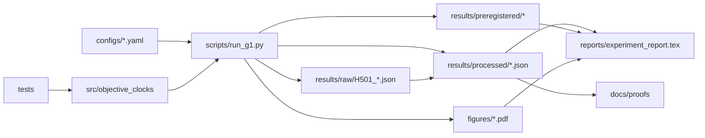
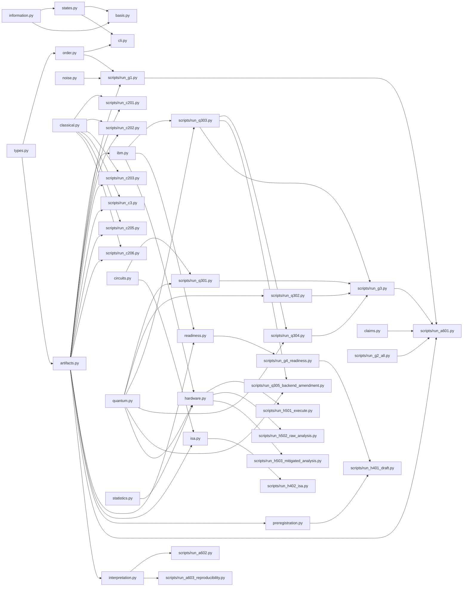

# Architecture and Flow Diagrams

This document is the live repository architecture map. It must be updated when
module responsibilities, experiment flow or theorem semantics change.

## System Architecture

## Data Flow Graph

```mermaid
flowchart TD
    RecordCode["RecordCode(labels, bits)"] --> Dominance["dominance_matrix"]
    Dominance --> Poset["quotient poset / Hasse DAG"]
    Poset --> Chains["maximal persistent chains"]
    Poset --> LinExt["linear extensions (scheduler only)"]
    Chains --> ScalarGate["scalar_timeline gate"]
    LinExt --> Diagnostics["ambiguity diagnostics"]
    ScalarGate --> T101["T101_chain_verification.json"]
    Diagnostics --> T101
    Capacity["capacity formulas"] --> T103["T103_capacity.json"]
    Noise["majority/binomial/Hoeffding"] --> T104["T104_noise_bound_grid.json"]
    C0Config["configs/classical.yaml C0"] --> C0Runner["scripts/run_c201.py"]
    C0Runner --> C0Parquet["C0_theorem_verification.parquet"]
    C0Runner --> C0Report["C0_runtime_report.json"]
    C1Config["configs/classical.yaml C1"] --> C1Runner["scripts/run_c202.py"]
    C1Runner --> C1NetCDF["C1_basis_landscape.nc"]
    C1Runner --> Fig02["fig_02_basis_landscape.pdf"]
    C2Config["configs/classical.yaml C2"] --> C2Runner["scripts/run_c203.py"]
    C2Runner --> C2Parquet["C2_order_catalog.parquet"]
    C2Runner --> C2Graphs["C2_graphs/*.graphml"]
    C3Config["configs/classical.yaml C3"] --> C3Runner["scripts/run_c3.py"]
    C3Runner --> C3Parquet["C3_noise_phase_diagram.parquet"]
    C3Runner --> Fig04["fig_04_noise_phase.pdf"]
    C4Controls["C4 controls"] --> C4Runner["scripts/run_c205.py"]
    C4Runner --> C4Json["C4_assumption_failures.json"]
    C5Exact["GHZ/dephased exact states"] --> C5Runner["scripts/run_c206.py"]
    C5Runner --> C5Json["C5_ghz_exact.json"]
    C5Runner --> Fig05["fig_05_ghz_exact.pdf"]
    Q301Runner["scripts/run_q301.py"] --> Q301Manifest["Q301_circuit_manifest.json"]
    Q301Runner --> QPY["Q301_untranspiled_circuits.qpy"]
    Q302Runner["scripts/run_q302.py"] --> Q1Sweep["Q1_noise_sweep.parquet"]
    Q302Runner --> Q1Summary["Q1_noise_sweep_summary.json"]
    Q302Runner --> Q302Fig["fig_q302_noise_readiness.pdf"]
    QiskitAccount["~/.qiskit/qiskit-ibm.json (repo external)"] --> Q303Runner["scripts/run_q303.py"]
    OpenInstance["IBM open-instance metadata"] --> Q303Runner
    Q303Runner --> Q303Json["Q303_backend_candidates.json"]
    Q305Runner["scripts/run_q305_backend_amendment.py"] --> Q305Json["Q305_backend_amendment_diagnostics.json"]
    Q304Runner["scripts/run_q304.py"] --> Q2Twin["Q2_backend_twin.parquet"]
    Q304Runner --> Q2Summary["Q2_backend_twin_summary.json"]
    G3Runner["scripts/run_g3.py"] --> G3Manifest["G3_manifest.json"]
    Q301Manifest --> G3Runner
    QPY --> G3Runner
    Q1Sweep --> G3Runner
    Q1Summary --> G3Runner
    Q302Fig --> G3Runner
    Q303Json --> G3Runner
    Q305Json --> G3Runner
    Q2Twin --> G3Runner
    Q2Summary --> G3Runner
    G4AuditRunner["scripts/run_g4_readiness.py"] --> G4Audit["G4_readiness_audit.json"]
    G4AuditRunner --> G4Manifest["G4_readiness_manifest.json"]
    Q303Json --> G4AuditRunner
    Q2Summary --> G4AuditRunner
    Q1Summary --> G4AuditRunner
    H401ArchiveRunner["scripts/run_h401_archive.py"] --> H401Archive["environment_archive.tar.gz"]
    H401ArchiveRunner --> H401ArchiveManifest["environment_archive_manifest.json"]
    H402Runner["scripts/run_h402_isa.py"] --> H402QPY["results/preregistered/circuits.qpy"]
    H402Runner --> H402Manifest["results/preregistered/circuit_manifest.json"]
    H401Runner["scripts/run_h401_draft.py"] --> H401Draft["generated H401 draft packet"]
    H401Runner --> H401Summary["H401_preregistration_draft_summary.json"]
    H401FreezeRunner["scripts/run_h401_freeze.py"] --> H401Frozen["docs/PREREGISTRATION_FROZEN.md"]
    H401FreezeRunner --> H401FrozenManifest["preregistration_manifest.json"]
    H403Runner["scripts/run_h403_dry_run.py"] --> H403Report["dry_run_report.json"]
    H501Runner["scripts/run_h501_execute.py --execute"] --> H501Raw["results/raw/H501_provider_payload_*.json"]
    H501Runner --> H501Receipt["results/raw/H501_submission_receipt_*.json"]
    H502Runner["scripts/run_h502_raw_analysis.py"] --> H502Raw["Q3_hardware_raw.json"]
    H503Runner["scripts/run_h503_mitigated_analysis.py"] --> H503Mitigated["Q3_hardware_mitigated.json"]
    Q303Json --> H401Runner
    Q2Summary --> H401Runner
    H401ArchiveManifest --> H401Runner
    H402Manifest --> H401Runner
    G4Audit --> H401Runner
    H401Draft --> H401FreezeRunner
    H402Manifest --> H401FreezeRunner
    H402QPY --> H401FreezeRunner
    H401FrozenManifest --> H403Runner
    H402Manifest --> H403Runner
    H401FrozenManifest --> H501Runner
    H402Manifest --> H501Runner
    H402QPY --> H501Runner
    H501Raw --> H502Runner
    H501Raw --> H503Runner
    H502Raw --> H503Runner
    A601Runner["scripts/run_a601.py"] --> ClaimCSV["results/claim_evidence_matrix.csv"]
    A601Runner --> A601Summary["A601_claim_evidence_summary.json"]
    ClaimCSV --> A601Manifest["A601_manifest.json"]
    A601Summary --> A601Manifest
    A602Runner["scripts/run_a602.py"] --> FinalDecision["docs/FINAL_DECISION.md"]
    A602Runner --> A602Json["A602_final_decision.json"]
    A603Runner["scripts/run_a603_reproducibility.py"] --> ReproArchive["objective-clocks-reproducibility.tar.gz"]
    A603Runner --> A603Manifest["A603_reproducibility_manifest.json"]
    A603Manifest --> FinalDecision
    T101 --> A601Runner
    Capacity --> A601Runner
    Noise --> A601Runner
    C0Report --> A601Runner
    C1NetCDF --> A601Runner
    C2Parquet --> A601Runner
    C3Parquet --> A601Runner
    C4Json --> A601Runner
    C5Json --> A601Runner
    Q1Sweep --> A601Runner
    Q2Twin --> A601Runner
    H501Raw --> A601Runner
    H502Raw --> A601Runner
    H503Mitigated --> A601Runner
    A601Summary --> A602Runner
    ClaimCSV --> A602Runner
    H502Raw --> A602Runner
    H503Mitigated --> A602Runner
    A602Json --> A603Runner
```

## Control Flow Graph

```mermaid
flowchart TD
    Start["Start G0/G1"] --> ReadSpec["Read research notes and public artifact docs"]
    ReadSpec --> R001["R001: install and verify environment"]
    R001 --> R002["R002: manifests and write-once artifacts"]
    R002 --> R003["R003: semantic freeze"]
    R003 --> T101["T101: O1 chain verification"]
    T101 --> T102["T102: scalar timeline criterion"]
    T102 --> T103["T103: capacity bounds"]
    T103 --> T104["T104: noisy redundancy"]
    T104 --> T105["T105: imported B0"]
    T105 --> T106["T106: no-go package"]
    T106 --> C201["C201: C0 theorem verification"]
    C201 --> C202["C202: C1 basis landscape"]
    C202 --> C203["C203: C2 order catalog"]
    C203 --> C204["C204: C3 noise sweep"]
    C204 --> C205["C205: C4 assumption stress tests"]
    C205 --> C206["C206: C5 GHZ exact"]
    C206 --> Q301["Q301: freeze circuits and endianness"]
    Q301 --> Q302["Q302: generic Aer noise sweep"]
    Q301 --> Q303["Q303: deterministic backend and layout selection"]
    Q302 --> Q304["Q304: backend-derived aggregate local twin or stop row"]
    Q303 --> Q304
    Q304 --> G4Audit["G4 readiness audit: document blockers without submission"]
    G4Audit --> H401Archive["H401 archive: freeze environment inputs"]
    H401Archive --> H402ISA["H402 ISA packet: freeze transpiled circuits and execution order"]
    H402ISA --> H401Draft["H401 draft packet: complete mandatory fields"]
    H401Draft --> H401Freeze["H401 freeze: human approval recorded, QPU still disabled"]
    H401Freeze --> H403Dry["H403 dry-run: no Sampler invocation"]
    H403Dry --> H404Tag["H404 clean commit and v0.4-qpu-preregistered-kingston tag"]
    H404Tag --> H501Gate["H501 explicit env gate: ALLOW_QPU_EXECUTION=YES"]
    H501Gate --> H501Submit["H501 one SamplerV2 job"]
    H501Submit --> H502Raw["H502 locked raw analysis"]
    H502Raw --> H503Mitigated["H503 secondary readout mitigation"]
    H503Mitigated --> A601["A601: evidence-grade claims with bounded Q1/Q2 hardware illustration"]
    G4Audit --> A601
    A601 --> A602["A602: apply preregistered scientific decision tree"]
    A602 --> A603["A603: clean reproduction archive"]
```

## Dependency Graph

## Variables, Functions, Classes and Flows

```mermaid
flowchart TD
    RC["RecordCode.labels / RecordCode.bits"] --> DM["dominance_matrix(bits)"]
    DM --> Q["quotient_record_code(code)"]
    Q --> PG["poset_graph(bits)"]
    PG --> EMC["enumerate_maximal_chains(graph)"]
    PG --> CLE["count_linear_extensions(graph)"]
    RC --> IPS["is_persistent_sequence(code, sequence)"]
    RC --> IDCS["is_directed_chain_sequence(code, sequence)"]
    IPS --> O1["O1 verification: persistent iff directed chain"]
    IDCS --> O1
    Q --> STR["scalar_timeline(code)"]
    STR --> O11["O1.1 scalar time only when total and nondegenerate"]
    EM["environment_manifest()"] --> G0M["G0_environment_manifest.json"]
    FM["file_manifest(paths)"] --> G0F["G0_file_manifest.json"]
    C0Rows["c0_theorem_rows(C0Config)"] --> C0Out["C0 parquet + runtime report"]
    C1Landscape["c1_qubit_basis_landscape(theta, phi)"] --> C1Out["C1 NetCDF + figure"]
    C2Rows["c2_catalog_rows()"] --> C2Out["C2 parquet + GraphML"]
    C3Rows["c3_noise_rows(config, seed)"] --> C3Out["C3 parquet + phase figure"]
    C4Rows["c4_assumption_stress_matrix()"] --> C4Out["C4 JSON"]
    C5Rows["c5_ghz_exact_rows()"] --> C5Out["C5 JSON + GHZ figure"]
    QBitParser["parse_qiskit_bitstring(key)"] --> Q301Out["Q301 manifest"]
    CircuitFamily["named_science_circuits()"] --> Q301Out
    QNoiseRows["q302_noise_rows(config, seed)"] --> Q302Out["Q1 noise sweep + readiness figure"]
    RuntimeAccount["Qiskit saved account + open-instance"] --> EnvPresence["discover_ibm_env_keys()"]
    BackendRank["rank_backend_candidates(candidates)"] --> Q303Out["Q303 backend candidates"]
    EnvPresence["discover_ibm_env_keys()"] --> Q303Out
    AmendmentDiag["run Q305 backend-amendment diagnostics"] --> Q305Out["Q305 diagnostics"]
    BackendRank --> AmendmentDiag
    BackendTwin --> AmendmentDiag
    BackendTwin["run_backend_derived_twin(candidate, layout, config)"] --> Q304Out["Q2 backend-twin parquet + summary"]
    Q303Out --> BackendTwin
    Q302Out --> BackendTwin
    TokenSources["discover_ibm_token_sources(paths)"] --> G4Readiness["build_g4_readiness_audit(root)"]
    G4Readiness --> G4Out["G4 readiness audit + manifest"]
    ArchiveWriter["write_environment_archive()"] --> H401ArchiveOut["environment archive + manifest"]
    H402Packet["write_h402_isa_packet()"] --> H402Out["ISA QPY + circuit manifest"]
    PreregDraft["build_h401_preregistration_draft(root)"] --> H401Out["generated draft markdown + summary"]
    Q303Out --> PreregDraft
    Q304Out --> PreregDraft
    H401ArchiveOut --> PreregDraft
    H402Out --> PreregDraft
    G4Out --> PreregDraft
    H501GateCheck["validate_h501_preconditions()"] --> H501SubmitOut["H501 raw provider payload"]
    SamplerCounts["sampler_result_counts(result, execution_order)"] --> H501SubmitOut
    H501SubmitOut --> RawAnalysis["analyze_hardware_raw_payload()"]
    H501SubmitOut --> MitigatedAnalysis["analyze_readout_mitigated_payload()"]
    RawAnalysis --> Q3RawOut["Q3_hardware_raw.json"]
    MitigatedAnalysis --> Q3MitigatedOut["Q3_hardware_mitigated.json"]
    Q3RawOut --> ClaimsRows
    Q3MitigatedOut --> ClaimsRows
    ClaimsRows["build_claim_evidence_matrix(root)"] --> ClaimsCSV["claim_evidence_matrix.csv"]
    ClaimsRows --> ClaimsValidation["validate_claim_evidence_matrix(rows)"]
    ClaimsValidation --> A601Out["A601 summary + manifest"]
    FinalDecisionRows["build_final_decision(root)"] --> FinalDecisionOut["FINAL_DECISION.md + A602 JSON"]
    ClaimsCSV --> FinalDecisionRows
    Q3RawOut --> FinalDecisionRows
    Q3MitigatedOut --> FinalDecisionRows
    ReproPackage["write_reproducibility_package()"] --> ReproOut["archive + A603 manifest"]
    FinalDecisionOut --> ReproPackage
```

